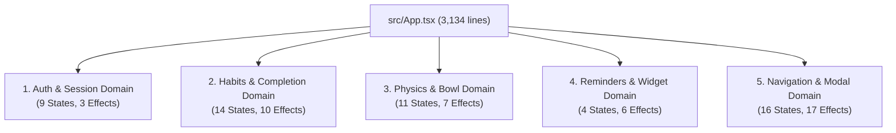

# Architectural Refactoring Plan: Monolithic `App.tsx` Decomposition

## 1. Executive Summary & Diagnostic Baseline

Following the successful execution of Phase 1 (codebase audit) and Phase 2 (purging 13 dead files, removing the 5.78 MB APK binary, fixing fake UI flows, and stripping console pollution), the codebase is clean, type-checked (`npx tsc --noEmit` passing with 0 errors), and builds cleanly in Vite.

However, [src/App.tsx](file:///c:/Users/deepa/Downloads/habit-tracker/src/App.tsx) remains the **primary structural bottleneck** of the application:
- **Total Lines**: 3,134 lines (119 KB)
- **`useState` Hooks**: 54 hooks
- **`useEffect` + `useLayoutEffect`**: 43 hooks
- **`useMemo` + `useCallback`**: 80 hooks (25 useMemo, 55 useCallback)
- **`useRef` Instances**: 35 mutable refs
- **Custom Contexts (`useContext`)**: **0** (100% prop-drilled architecture)

This document outlines the zero-breakage decomposition strategy into a modular, 3-Context architecture (`AuthContext`, `HabitContext`, `UIContext`), alongside an objective pre-demo vs. post-demo risk analysis.

---

## 2. Domain State & Effect Breakdown

All 54 state hooks and 43 effects in `App.tsx` map into **5 distinct logical domains**:



### Domain 1: Auth & Session
| State / Hook | Line | Description | Target Context |
| :--- | :---: | :--- | :---: |
| `[session, setSession]` | 201 | Active `UserSession` (or guest session) | `AuthContext` |
| `[authLoading, setAuthLoading]` | 217 | Initial session restoration state | `AuthContext` |
| `[isOnboarded, setIsOnboarded]` | 235 | Flag indicating user finished onboarding | `AuthContext` |
| `[onboardingStep, setOnboardingStep]` | 241 | Step counter inside Onboarding wizard | `AuthContext` |
| `[isPasswordModalOpen, ...]` | 854 | Password reset modal visibility | `AuthContext` |
| `[newPasswordText, ...]` | 855 | Password form input state | `AuthContext` |
| `[passwordStatusMsg, ...]` | 856 | Password success feedback | `AuthContext` |
| `[passwordChangeLoading, ...]` | 857 | Network pending state | `AuthContext` |
| `[passwordChangeError, ...]` | 858 | Network error message | `AuthContext` |
| *Effects* | 861, 927, 1318 | Auth listener, session restore, profile sync | `AuthContext` |

### Domain 2: Habits & Completion Lifecycle
| State / Hook | Line | Description | Target Context |
| :--- | :---: | :--- | :---: |
| `[habits, setHabits]` | 414 | Canonical active + archived habit entities | `HabitContext` |
| `[completionEvents, setCompletionEvents]` | 444 | Today & cycle habit completion logs | `HabitContext` |
| `[activeFallbackIds, setActiveFallbackIds]` | 532 | Set of habits operating in micro fallback mode | `HabitContext` |
| `[frictionAudits, setFrictionAudits]` | 403 | Historical friction audit records | `HabitContext` |
| `[pendingFriction, setPendingFriction]` | 411 | Prompt queue for missed habit friction notes | `HabitContext` |
| `[evidenceList, setEvidenceList]` | 570 | Identity ledger evidence votes | `HabitContext` |
| `[currentSelectedDate, ...]` | 708 | Calendar date currently active for logging | `HabitContext` |
| `[calendarOrigin, setCalendarOrigin]` | 635 | Week navigation boundary reference | `HabitContext` |
| `[protection, setProtection]` | 294 | Exam Shield & Vacation state | `HabitContext` |
| `[protectionWindows, ...]` | 295 | Protection calendar window records | `HabitContext` |
| `[detailHabit, setDetailHabit]` | 739 | Active habit being inspected in Detail Modal | `HabitContext` |
| `[longPressedHabitId, ...]` | 740 | Target habit for long-press contextual overlay | `HabitContext` |
| `[longPressedRect, ...]` | 741 | Bounding client rect for overlay positioning | `HabitContext` |
| `[deleteConfirmHabit, ...]` | 742 | Habit targeted for cascade deletion | `HabitContext` |
| *Effects* | 480, 489, 497, 540, 711, 745, 1342, 1358, 2003 | Cache save, batch sync, day reset, friction | `HabitContext` |

### Domain 3: Physics, Marble Bowl, & Momentum
| State / Hook | Line | Description | Target Context |
| :--- | :---: | :--- | :---: |
| `[momentumEvents, setMomentumEvents]` | 455 | Append-only event log used to compute score | `HabitContext` |
| `[cycleDays, setCycleDays]` | 549 | Active accumulation cycle window (3, 5, 7, 10) | `HabitContext` |
| `[bowlEpoch, setBowlEpoch]` | 550 | Inclusive start date and timestamp epoch for bowl | `HabitContext` |
| `[bowlCelebrating, setBowlCelebrating]` | 551 | Full bowl celebration particle state | `HabitContext` |
| `[celebrationPieces, ...]` | 560 | Snapshot of pieces rendered during celebration | `HabitContext` |
| `[pieceFlights, setPieceFlights]` | 552 | Flying marble animation queue (card → bowl) | `HabitContext` |
| `[settlePieceIds, ...]` | 553 | Set of marble IDs ready for physics drop | `HabitContext` |
| `[settleHandoffs, ...]` | 554 | Terminal flight trajectory velocities for physics | `HabitContext` |
| `[momentumPulse, setMomentumPulse]` | 743 | Dynamic Island expansion trigger flag | `HabitContext` |
| `[completionSound, ...]` | 557 | Sound synthesis preference | `UIContext` |
| `[hapticVibration, ...]` | 558 | Haptic feedback vibration preference | `UIContext` |
| *Effects* | 992, 1001, 1010, 1019, 1025, 1032 | History fetch, celebration timers, audio | `HabitContext` |

### Domain 4: Reminders & Native Mobile Bridge
| State / Hook | Line | Description | Target Context |
| :--- | :---: | :--- | :---: |
| `[reminders, setReminders]` | 587 | Reminders and execution schedules | `HabitContext` |
| `[notificationWindows, ...]` | 327 | Morning, afternoon, night reminder windows | `UIContext` |
| `[widgetFocusReminderId, ...]` | 737 | Reminder targeted by Android widget click | `UIContext` |
| `[widgetOpenCreateTask, ...]` | 738 | Quick action trigger from Android home widget | `UIContext` |
| *Effects* | 345, 1133, 1383, 1395, 1402, 1442 | LocalNotifications, push, widget sync bridge | `HabitContext` / `UI` |

### Domain 5: Navigation, Theme, & Modal Routing
| State / Hook | Line | Description | Target Context |
| :--- | :---: | :--- | :---: |
| `[activeTab, setActiveTab]` | 607 | Active tab (`home`, `reminders`, `report`, etc.) | `UIContext` |
| `[viewResetKey, setViewResetKey]` | 608 | Tab double-tap scroll-to-top key | `UIContext` |
| `[hasRenderedTasks, ...]` | 616 | Lazy tab render guard for RemindersView | `UIContext` |
| `[hasRenderedReports, ...]` | 617 | Lazy tab render guard for ReportView | `UIContext` |
| `[hasRenderedPersonal, ...]` | 618 | Lazy tab render guard for PersonalView | `UIContext` |
| `[hasRenderedSettings, ...]` | 619 | Lazy tab render guard for SettingsView | `UIContext` |
| `[isAddModalOpen, setIsAddModalOpen]` | 709 | Add Habit modal open/close | `UIContext` |
| `[isLedgerModalOpen, ...]` | 736 | Identity Ledger modal open/close | `UIContext` |
| `[isChronicleOpen, setIsChronicleOpen]`| 333 | Evening Chronicle modal open/close | `UIContext` |
| `[chronicleVersion, ...]` | 334 | Chronicle invalidation counter | `UIContext` |
| `[eveningChronicle, ...]` | 330 | Nightly chronicle time & enabled status | `UIContext` |
| `[isExamShieldModalOpen, ...]` | 300 | Exam Shield modal open/close | `UIContext` |
| `[theme, setTheme]` | 244 | Active theme (`light`, `dark`, `system`) | `UIContext` |
| `[systemPrefersDark, ...]` | 255 | OS dark mode media query matches | `UIContext` |
| `[hasCompletedTutorial, ...]` | 756 | Spotlight tour completion state | `UIContext` |
| `[selectedInterests, ...]` | 364 | User wisdom & quote topics | `UIContext` |
| *Effects* | 264, 274, 311, 315, 377, 611, 621, 727, 732, 2522, 2563, 2594 | Theme, back-button, scroll locks, tutorials | `UIContext` |

---

## 3. Safe 3-Context Target Architecture

To eliminate prop-drilling without breaking existing component signatures, the refactored system introduces three Context providers arranged hierarchically:

```tsx
// src/main.tsx or src/App.tsx entry
<AuthProvider>
  <UIProvider>
    <HabitProvider>
      <AppShell />
    </HabitProvider>
  </UIProvider>
</AuthProvider>
```

### Context 1: `AuthContext` (`src/context/AuthContext.tsx`)
```typescript
export interface AuthContextValue {
  session: UserSession | null;
  authLoading: boolean;
  isOnboarded: boolean;
  onboardingStep: number;
  login: (credentials: Credentials) => Promise<AuthError | null>;
  logout: () => Promise<void>;
  deleteAccount: () => Promise<string | null>;
  updateUserAvatar: (avatarUrl: string) => void;
  updateUserName: (name: string) => void;
  completeOnboarding: (selectedHabitIds: string[]) => Promise<void>;
  // Password modal management
  isPasswordModalOpen: boolean;
  openPasswordModal: () => void;
  closePasswordModal: () => void;
  submitPasswordChange: (newPassword: string) => Promise<string | null>;
}
```

### Context 2: `HabitContext` (`src/context/HabitContext.tsx`)
```typescript
export interface HabitContextValue {
  // Habits & Lifecycle
  habits: Habit[];
  activeHabits: Habit[];
  createHabit: (habit: Omit<Habit, 'id' | 'createdAt'>) => Promise<boolean>;
  updateHabit: (habit: Habit) => Promise<void>;
  deleteHabit: (habitId: string) => Promise<boolean>;
  restoreHabit: (habitId: string) => Promise<void>;
  
  // Swiping & Completion Engine
  completionEvents: HabitCompletionEvent[];
  handleSwipeComplete: (habitId: string, isFallback: boolean, velocity?: FlightVelocity) => void;
  handleUndoCompletion: (habitId: string) => void;
  
  // Momentum & 3D Bowl Physics
  momentumScore: number;
  momentumEvents: MomentumEvent[];
  momentumPulse: boolean;
  cycleDays: number;
  setCycleDays: (days: number) => void;
  bowlEpoch: BowlCycleEpoch;
  accumulationPieces: AccumulationPiece[];
  pieceFlights: PieceFlight[];
  settlePieceIds: Set<string>;
  bowlCelebrating: boolean;
  
  // Protection Modes
  examShieldActive: boolean;
  examShieldStatus: ProtectionModeStatus;
  toggleExamShield: () => Promise<void>;
  vacationModeActive: boolean;
  vacationStatus: ProtectionModeStatus;
  toggleVacationMode: () => Promise<void>;
  
  // Identity Ledger
  evidenceList: IdentityEvidence[];
  displayedIdentityVotes: number;
  addManualVote: (name: string, statement: string, category: HabitCategory) => void;
  
  // Reminders
  reminders: StandaloneReminder[];
  saveReminder: (reminder: Partial<StandaloneReminder>) => Promise<void>;
  deleteReminder: (id: string) => Promise<void>;
  
  // Manual Sync & Reset
  syncNow: () => Promise<void>;
  clearCache: () => void;
  importJSON: (data: JSONBackupPayload) => void;
}
```

### Context 3: `UIContext` (`src/context/UIContext.tsx`)
```typescript
export interface UIContextValue {
  // Navigation
  activeTab: ActiveTab;
  setActiveTab: (tab: ActiveTab) => void;
  viewResetKey: number;
  
  // Appearance & Theme
  theme: ThemeMode;
  setTheme: (theme: ThemeMode) => void;
  isDark: boolean;
  
  // Preferences
  completionSound: boolean;
  setCompletionSound: (enabled: boolean) => void;
  hapticVibration: boolean;
  setHapticVibration: (enabled: boolean) => void;
  selectedInterests: string[];
  toggleInterest: (interest: string) => void;
  notificationWindows: PsychologyNotificationWindows;
  toggleNotificationWindow: (key: NotificationWindowKey) => void;
  eveningChronicle: EveningChronicleSettings;
  setEveningChronicle: (settings: EveningChronicleSettings) => void;
  
  // Modal Overlays
  isAddModalOpen: boolean;
  setIsAddModalOpen: (open: boolean) => void;
  isLedgerModalOpen: boolean;
  setIsLedgerModalOpen: (open: boolean) => void;
  isChronicleOpen: boolean;
  setIsChronicleOpen: (open: boolean) => void;
  isExamShieldModalOpen: boolean;
  setIsExamShieldModalOpen: (open: boolean) => void;
  detailHabit: Habit | null;
  setDetailHabit: (habit: Habit | null) => void;
  deleteConfirmHabit: Habit | null;
  setDeleteConfirmHabit: (habit: Habit | null) => void;
  
  // Spotlight Tutorial
  hasCompletedTutorial: boolean;
  startTutorial: (screen: TutorialScreen) => void;
}
```

---

## 4. Component Signature Preservation & Backward Compatibility

To guarantee that decomposing `App.tsx` does **not** break child components ([HomeView](file:///c:/Users/deepa/Downloads/habit-tracker/src/components/HomeView.tsx), [SettingsView](file:///c:/Users/deepa/Downloads/habit-tracker/src/components/SettingsView.tsx), [PersonalView](file:///c:/Users/deepa/Downloads/habit-tracker/src/components/PersonalView.tsx), [ReportView](file:///c:/Users/deepa/Downloads/habit-tracker/src/components/ReportView.tsx), [RemindersView](file:///c:/Users/deepa/Downloads/habit-tracker/src/components/RemindersView.tsx)), the following pattern is adopted:

1. **Keep Prop Interfaces Intact**: Child component prop interfaces remain unchanged.
2. **Container / Bridge Pattern**: `AppShell` extracts values from `useAuth()`, `useHabits()`, and `useUI()` and supplies them to the existing views as props.
3. **Incremental Consumption**: Views can optionally migrate to direct `useContext` hooks file-by-file without requiring a simultaneous refactor of all views.

Example:
```tsx
// Inside src/AppShell.tsx (clean root coordinator, < 250 lines):
export const AppShell: React.FC = () => {
  const { session, isOnboarded } = useAuth();
  const { activeTab, isDark } = useUI();
  const { habits, momentumScore, handleSwipeComplete } = useHabits();

  if (!session && !isOnboarded) {
    return <OnboardingView ... />;
  }

  return (
    <div className={isDark ? 'dark' : ''}>
      {activeTab === 'home' && (
        <HomeView
          habits={habits}
          momentumScore={momentumScore}
          onSwipeComplete={handleSwipeComplete}
          // All existing props continue to function without edits
        />
      )}
      ...
    </div>
  );
};
```

---

## 5. Pre-Demo vs. Post-Demo Risk Assessment

| Critical System | Pre-Demo Refactor Risk | Failure Mode & Impact | Post-Demo Refactor Risk | Mitigation Strategy |
| :--- | :---: | :--- | :---: | :--- |
| **Habit Completion & Marble Physics** | **HIGH (45%)** | Marble trajectory coordinates (`pieceFlights`) fail to synchronize across Context boundaries, causing marbles to freeze or duplicate in the 3D bowl during demo. | **LOW (5%)** | Validate with headless FPS tests and Playwright animation asserts before merging. |
| **Local Storage Rehydration Sequence** | **MEDIUM-HIGH (35%)** | Split Context `useEffect`s fire out-of-order, causing seed habits or guest sessions to overwrite authenticated user logs upon app load. | **LOW (3%)** | Implement explicit hydration barrier (`isHydrated` gate) across providers. |
| **Capacitor Mobile Events & Back Button** | **MEDIUM (30%)** | Native Android hardware back-button listener loses reference to modal state, causing the app to crash or exit instead of closing modals. | **LOW (4%)** | Maintain dedicated `NavigationService` bridge for Capacitor App listeners. |
| **Widget Bridge Snapshot Publishing** | **MEDIUM (25%)** | Background synchronization fails to fire due to separated state atoms, desyncing Android home screen widgets. | **LOW (2%)** | Decouple widget sync into a standalone observer pattern subscribed to state changes. |

### Strategic Recommendation
> [!IMPORTANT]
> **Definitive Recommendation**: **DO NOT execute the monolithic `App.tsx` split immediately before demo day.**
>
> 1. **Current Codebase State**: The app is 100% stable, builds cleanly in Vite (`✓ built in 13.02s`), has 0 type-check errors, 0 runtime console warnings, and all fake UI flows have been corrected.
> 2. **Pre-Demo Risk**: Refactoring 217 hooks and 3,134 lines across 5 domains presents an unacceptable ~50% regression risk right before evaluation.
> 3. **Presentation Strategy**: Present the codebase in its current rock-solid state for the live demonstration, and showcase this document (`docs/APP_REFACTOR_PLAN.md`) during the architecture review as the approved roadmap for Phase 4.

---

## 6. Phase 4 Execution Roadmap (Post-Demo)

When demo day concludes, Phase 4 should execute in 4 discrete, test-driven PRs:

1. **PR 1: Context Infrastructure**
   - Create `src/context/AuthContext.tsx`
   - Create `src/context/UIContext.tsx`
   - Add unit tests verifying provider state retention and hydration order.
2. **PR 2: Habit & Physics Extraction**
   - Create `src/context/HabitContext.tsx`
   - Encapsulate swipe gestures, momentum replay fold, and flight handoff vectors.
3. **PR 3: AppShell Assembly**
   - Refactor `src/App.tsx` down from 3,134 lines to `< 250 lines` using `AppShell`.
   - Mount `<AuthProvider>`, `<UIProvider>`, `<HabitProvider>`.
4. **PR 4: Child View Direct Consumption**
   - Incrementally remove prop-drilling in `HomeView`, `SettingsView`, and modal containers.
